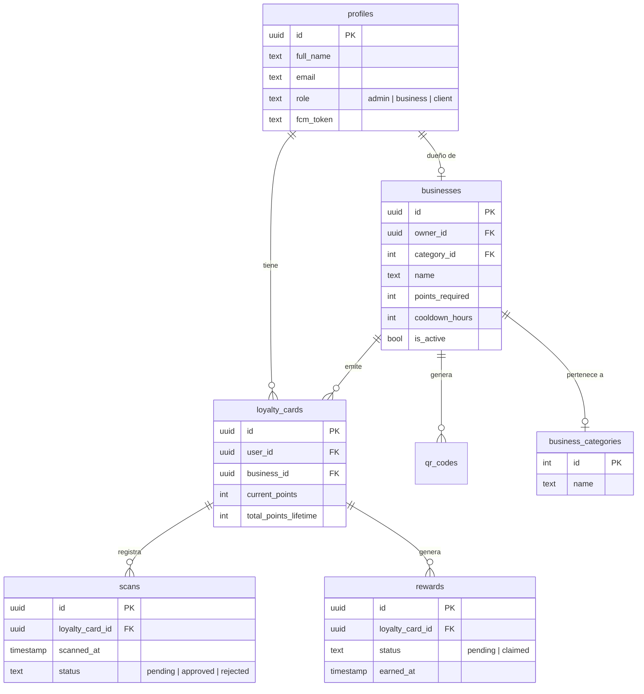

# 🗄️ Esquema de Base de Datos y Lógica de Servidor

Fidelity utiliza **Supabase (PostgreSQL)**. La lógica crítica reside en la base de datos para garantizar que las reglas de negocio se cumplan sin importar desde dónde se acceda a los datos.

## 📊 Diagrama Entidad-Relación

## 🧠 Lógica de Servidor (PL/pgSQL)

### 1. Funciones RPC Críticas
-   **`add_manual_points`**: Permite al dueño de un negocio asignar puntos directamente. 
    -   *Validación*: Bloquea la asignación si el usuario tiene un premio pendiente de canje.
    -   *Automatización*: Si el usuario alcanza el límite, inserta automáticamente un registro en `rewards` y resetea los puntos en `loyalty_cards`.
-   **`get_or_create_loyalty_card`**: Asegura que un usuario siempre tenga una tarjeta activa para un negocio antes de realizar cualquier operación.

### 2. Triggers y Reglas
-   **Cooldown de Escaneo**: (Pendiente de documentación técnica específica del trigger) - Impide que un cliente escanee dos veces en el mismo local en un rango de X horas (definido en `businesses.cooldown_hours`).
-   **Realtime**: Las tablas `scans`, `rewards` y `loyalty_cards` tienen habilitado **Supabase Realtime**. Esto permite que el dashboard del negocio se actualice INSTANTÁNEAMENTE cuando un cliente escanea un código.

## 🔒 Seguridad (RLS)
Todas las tablas tienen **Row Level Security** activado:
-   **Clientes**: Solo pueden ver sus propias tarjetas, escaneos y premios.
-   **Negocios**: Solo pueden ver datos vinculados a su `business_id`.
-   **Admins**: Acceso total de lectura para auditoría.

---
> [!IMPORTANT]
> Nunca desactives el RLS en producción. Si necesitás saltar las reglas para una función administrativa, usá `SECURITY DEFINER` en la función PL/pgSQL.
